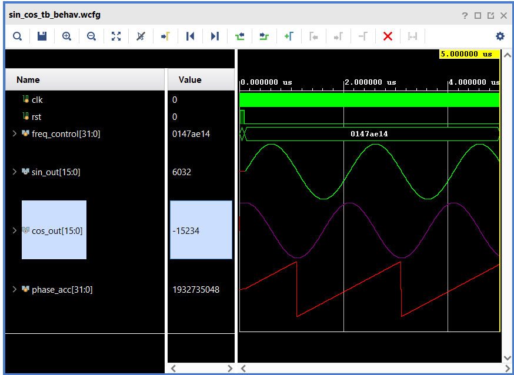

# FPGA-Based 16-Bit Fixed-Point CORDIC Sine/Cosine Generator

## 1. Project Overview
This project implements a hardware-efficient Direct Digital Synthesizer (DDS) using the CORDIC (Coordinate Rotation Digital Computer) algorithm on an FPGA platform. The design generates high-precision, continuous Sine and Cosine waveforms using a 16-stage iterative rotation engine. Unlike traditional methods that rely on memory-intensive Look-Up Tables (LUTs) or DSP-heavy Taylor series expansions, this implementation utilizes a shift-and-add architecture, optimizing the design for silicon area efficiency, low power consumption, and high throughput in VLSI systems.

## 2. What is CORDIC?
CORDIC (Coordinate Rotation Digital Computer) is an iterative algorithm used to calculate hyperbolic and trigonometric functions. Developed by Jack E. Volder in 1959, it decomposes a rotation angle into a series of micro-rotations using elementary angles ($\arctan(2^{-i})$).

The core principle relies on vector rotation:    
$$x_{i+1} = x_i - d_i \cdot y_i \cdot 2^{-i}$$       
$$y_{i+1} = y_i + d_i \cdot x_i \cdot 2^{-i}$$     
$$z_{i+1} = z_i - d_i \cdot \arctan(2^{-i})$$

By constraining the rotation angles to powers of two ($2^{-i}$), the multiplication operations are reduced to simple **binary shifts**, which are computationally inexpensive in hardware.

## 3. The Need for CORDIC in VLSI
In digital hardware design, calculating trigonometric functions presents specific challenges:
* **Look-Up Tables (LUTs):** Require exponential memory growth as precision increases.
* **Power Series (Maclaurin/Taylor):** Require multiple hardware multipliers, which consume significant chip area and power.

**CORDIC provides the optimal solution for hardware implementation because:**
* It requires **zero hardware multipliers**, using only shifters and adders.
* It scales linearly in complexity with bit precision.
* It naturally generates both Sine and Cosine components simultaneously.

## 4. System Architecture & Technical Specifications
The design is modularized into three primary stages to ensure stability and timing closure.

### A. Phase Accumulator
* **Width:** 32-bit
* **Function:** Generates a sawtooth waveform representing the instantaneous phase angle $\theta$ (0 to $2\pi$).
* **Frequency Control:** The output frequency is determined by the input control word `freq_control` according to the formula:
    

### B. Quadrant Mapper
* **Input:** 32-bit Phase Angle
* **Logic:** Since the standard CORDIC convergence range is limited to $\pm 90^{\circ}$, this stage inspects the two Most Significant Bits (MSBs) of the phase accumulator. It performs necessary pre-rotation mapping to extend the valid range to the full $0^{\circ} - 360^{\circ}$ cycle.

### C. Iterative CORDIC Core
* **Architecture:** 16-iteration combinational unrolled loop.
* **Arithmetic:** 16-bit Signed Fixed-Point (Q2.14 Format).
    * **Scale:** $1.0 \approx 16384$ (decimal).
    * **Gain Compensation:** The system is initialized with the cumulative product of the cosine terms ($K \approx 0.607$) to eliminate the need for a final scaling multiplier.

## 5. Code
* **[RTL Design Source (Verilog)](./sin_cos.v)**: Contains the synthesizable module including the look-up table constants, quadrant logic, and rotation engine.
* **[Testbench (Verilog)](./sin_cos_tb.v)**: Simulation environment configured to generate a 100MHz clock, handle reset sequencing, and drive frequency control stimuli.

## 6. Simulation Results
The design was verified using Xilinx Vivado. The waveform analysis confirms the correct phase relationship and amplitude stability.

**Waveform Analysis:**
* **Green Trace (sin_out):** Represents the generated Sine wave. The amplitude oscillates between +16383 and -16383 (representing $\pm 1.0$), confirming correct fixed-point scaling.
* **Red Trace (phase_acc):** The linear ramp (sawtooth) confirms the phase accumulator is correctly wrapping at the 32-bit boundary, driving the CORDIC engine through full $360^{\circ}$ cycles.
* **Correlation:** The zero-crossings of the sine wave perfectly align with the $0^{\circ}$ (min) and $180^{\circ}$ (midpoint) of the phase accumulator.

## 7. Future Improvements
* **Pipelining:** Convert the iterative combinational loop into a fully pipelined architecture to achieve 1-clock-cycle throughput for high-speed DSP applications.
* **AXI Interface:** Wrap the core in an AXI4-Stream interface to facilitate integration with standard IP blocks in Zynq/MicroBlaze systems.
* **Tangent/Magnitude Mode:** Extend the logic to support vectoring mode for calculating magnitude and phase from input coordinates (Rectangular-to-Polar conversion).

## 8. Acknowledgements
This project was developed under the guidance of:

**[Dr.Elango S](https://www.linkedin.com/in/elango-sekar-8973b958/)**
